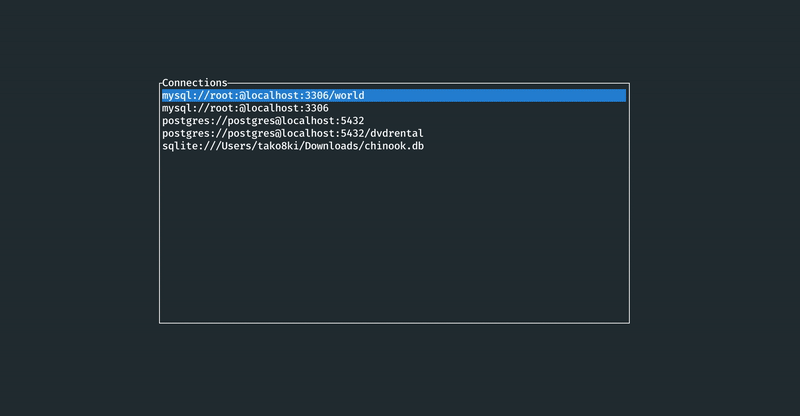

<div align="center">


gobang is currently in alpha

A cross-platform terminal database tool written in Rust

[](https://github.com/TaKO8Ki/gobang/actions) [](https://crates.io/crates/gobang)



</div>

## Features

- Cross-platform support (macOS, Windows, Linux)
- Multiple Database support (MySQL PostgreSQL, SQLite)
- Intuitive keyboard only control

## Installation

### Cargo

If you already have a Rust environment set up, you can use the `cargo install` command:

```
$ cargo install --version 0.1.0-alpha.1 gobang
```
## Keymap

| Key | Description |
| ---- | ---- |
| <kbd>h</kbd> | Scroll left |
| <kbd>j</kbd> | Scroll down |
| <kbd>k</kbd> | Scroll up |
| <kbd>l</kbd> | Scroll right |
| <kbd>Ctrl</kbd> + <kbd>d</kbd> | Scroll down multiple lines |
| <kbd>Ctrl</kbd> + <kbd>u</kbd> | Scroll up multiple lines |
| <kbd>y</kbd> | Copy a cell value |
| <kbd>→</kbd> | Move focus to right |
| <kbd>←</kbd> | Move focus to left |
| <kbd>/</kbd> | Filter |
| <kbd>1</kbd>, <kbd>2</kbd>, <kbd>3</kbd>, <kbd>4</kbd>, <kbd>5</kbd> | Switch to records, columns, constraints, foreign keys, indexes tab |

## Configuration

The location of the file depends on your OS:

- macOS: `$HOME/.config/gobang/config.toml`
- Linux: `$HOME/.config/gobang/config.toml`
- Windows: `%APPDATA%/gobang/config.toml`

The following is a sample config.toml file:

```toml
[[conn]]
type = "mysql"
user = "root"
host = "localhost"
port = 3306

[[conn]]
type = "mysql"
user = "root"
host = "localhost"
port = 3306
database = "foo"

[[conn]]
type = "postgres"
user = "root"
host = "localhost"
port = 5432
database = "bar"

[[conn]]
type = "sqlite"
path = "/path/to/baz.db"
```
